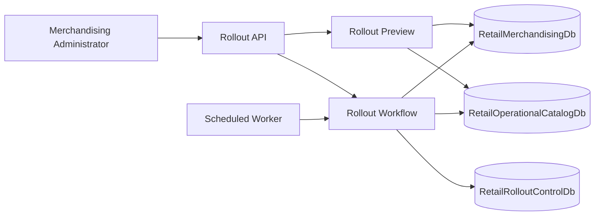

# Architecture

## Business Capability

The rollout pipeline controls when approved merchandising product changes become visible in the operational retail catalog used by stores and ecommerce channels.

The core business outcome is controlled promotion:

1. Preview the difference between the approved merchandising version and the current operational catalog.
2. Bind approval to the previewed change set with a preview fingerprint.
3. Schedule the rollout for a business-approved time.
4. Execute due rollouts through a background worker.
5. Record rollout status for audit and operational support.

## Logical Components

## Data Boundaries

`RetailMerchandisingDb` owns approved merchandising versions. It represents the source-of-truth system where product drops are prepared and approved.

`RetailOperationalCatalogDb` owns the product assortment currently visible to stores and ecommerce channels. This database should change only through controlled rollout execution.

`RetailRolloutControlDb` owns scheduled rollout decisions, preview fingerprints, execution timestamps, status, and failure messages. The application uses a SQL-backed rollout ledger for this boundary when the `RolloutControl` connection string is configured.

## Execution Guard

The preview fingerprint protects against drift between approval and execution. If the merchandising version or operational product changes after preview, the scheduled rollout is blocked instead of publishing an unapproved change set.

## Current Implementation Stage

The application contracts already model the target boundaries. The rollout-control boundary now has a SQL Server implementation. The merchandising and operational catalog adapters remain local so the business workflow can evolve in focused increments.

The repository includes Docker SQL Server, schema scripts, and seed data for local development.

## Worker Concurrency

Due rollouts are claimed by the rollout ledger before operational product data is published. The SQL Server ledger atomically moves eligible rows from `Scheduled` to `Publishing` with update locks and `READPAST`, so multiple worker instances can sweep for due rollouts without publishing the same scheduled rollout twice.

The claim records `ClaimedAt` and `ClaimedBy`. If a worker crashes after claiming a rollout, a later sweep can reclaim `Publishing` rows whose claim is older than the stale-claim timeout. This keeps horizontal workers safe under normal contention and recoverable after worker failure.
