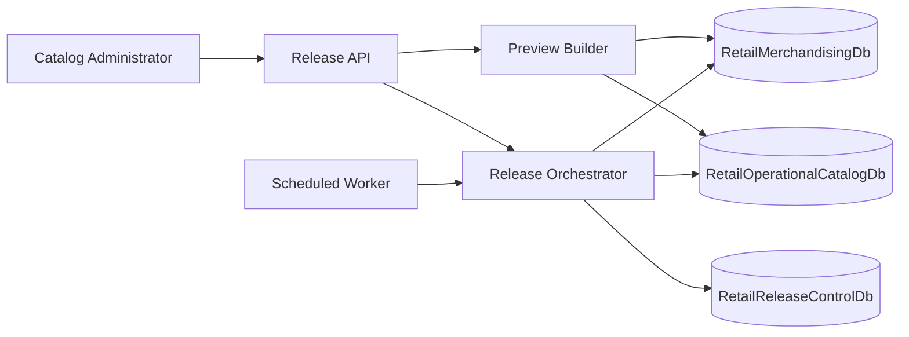

# Architecture

## Business Capability

The release pipeline controls when approved merchandising catalog changes become visible in the operational retail catalog used by stores and ecommerce channels.

The core business outcome is controlled promotion:

1. Preview the difference between the approved merchandising version and the current operational catalog.
2. Bind approval to the previewed change set with a preview fingerprint.
3. Schedule the release for a business-approved time.
4. Execute due releases through a background worker.
5. Record release status for audit and operational support.

## Logical Components

## Data Boundaries

`RetailMerchandisingDb` owns approved catalog versions. It represents the source-of-truth system where product drops are prepared and approved.

`RetailOperationalCatalogDb` owns the catalog currently visible to stores and ecommerce channels. This database should change only through controlled release execution.

`RetailReleaseControlDb` owns scheduled release decisions, preview fingerprints, execution timestamps, status, and failure messages.

## Execution Guard

The preview fingerprint protects against drift between approval and execution. If the merchandising version or operational catalog changes after preview, the scheduled release is blocked instead of publishing an unapproved change set.

## Current Implementation Stage

The application contracts already model the target boundaries. The current adapters are local implementations so the business workflow, release lifecycle, and tests can be developed before introducing SQL-backed adapters.

The repository includes Docker SQL Server, schema scripts, and seed data for the next implementation step.
